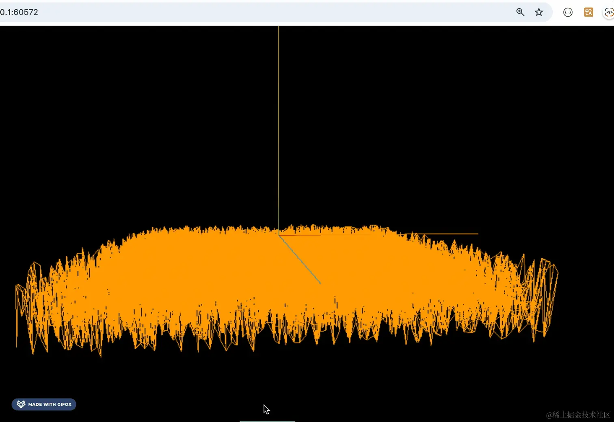

# 实战：随机山脉地形

学完顶点和网格模型之后，我们来做一个实战：生成山脉地形。

网格模型是由顶点构成三角形，可以分段，这样就会有更多顶点：

比如 PlaneGeometry 设置不同分段（segments）的时候：


顶点数量不一样。

那如果我们设置了分段，生成一堆顶点之后，再对这些顶点坐标做一些随机的变换呢？

是不是就是随机的地形图了？

当然，山脉地形并不是完全随机的，它是有一定的连续性，看起来比较自然。

这种就要用噪音算法来做了，山脉地形、云朵、火焰这种，都是用噪音算法来做。

我们用 [simplex-noise](https://www.npmjs.com/package/simplex-noise) 这个库：

```bash
mkdir mountain-terrain
cd mountain-terrain
npm init -y
```
进入项目，安装用到的 ts 类型
```bash
npm install --save-dev @types/three
```
创建 index.html
```html
<!DOCTYPE html>
<html lang="en">
<head>
    <meta charset="UTF-8">
    <meta name="viewport" content="width=device-width, initial-scale=1.0">
    <title>Document</title>
    <style>
        body {
            margin: 0;
        }
    </style>
</head>
<body>
    <script type="importmap">
    {
        "imports": {
            "three": "https://esm.sh/three@0.174.0/build/three.module.js",
            "three/addons/": "https://esm.sh/three@0.174.0/examples/jsm/"
        }
    }
    </script>
    <script type="module" src="./index.js"></script>
</body>
</html>
```
然后写下 index.js
```js
import * as THREE from 'three';
import {
    OrbitControls
} from 'three/addons/controls/OrbitControls.js';
import mesh from './mesh.js';

const scene = new THREE.Scene();

scene.add(mesh);

const axesHelper = new THREE.AxesHelper(200);
scene.add(axesHelper);

const width = window.innerWidth;
const height = window.innerHeight;

const camera = new THREE.PerspectiveCamera(60, width / height, 1, 10000);
camera.position.set(200, 200, 200);
camera.lookAt(0, 0, 0);

const renderer = new THREE.WebGLRenderer();
renderer.setSize(width, height)

function render() {
    renderer.render(scene, camera);
    requestAnimationFrame(render);
}

render();

document.body.append(renderer.domElement);

const controls = new OrbitControls(camera, renderer.domElement);
```
创建 Scene、Camera、Renderer 还有 OrbitControls，先不添加光源。

然后来写下 mesh.js
```js
import * as THREE from 'three';

const geometry = new THREE.PlaneGeometry(300, 300, 10, 10);

const material = new THREE.MeshBasicMaterial({
    color: new THREE.Color('orange'),
    wireframe: true
});

const mesh = new THREE.Mesh(geometry, material);

console.log(mesh);

export default mesh;
```
创建一个 300 * 300 的平面几何体，分成 10 段。

跑一下：
```bash
npx live-server
```


我们让它绕 x 轴旋转 90 度：


```js
mesh.rotateX(- Math.PI / 2);
```

然后让顶点坐标随机一下：


```js
const positions = geometry.attributes.position;

for (let i = 0 ; i < positions.count; i ++) {
    positions.setZ(i, Math.random() * 50);
}
```
顶点会按照 3 个一组来分组，position.count 是分组数，可以通过 setX、setY、setZ 修改某个分组的 xyz 值。
这里要修改 z 轴的坐标（按照旋转之前的坐标修改）。

可以看到，现在有一点山脉地形的感觉了。

有同学说，这样看起来用随机数感觉还好。

那是因为分段少的原因，把分段数改成 100：

这样就不行了：

我们要的是山脉那种有连续性的随机，而不是这种完全随机。

这时候就要用噪音的库 simplex-noise 了。

在 importmap 里注册下：


```js
<script type="importmap">
    {
        "imports": {
            "three": "https://esm.sh/three@0.174.0/build/three.module.js",
            "three/addons/": "https://esm.sh/three@0.174.0/examples/jsm/",
            "simplex-noise": "https://esm.sh/simplex-noise@4.0.3/dist/esm/simplex-noise.js"
        }
    }
</script>
```


传入 x、y 让噪音算法算出这个位置的 z

你就把他当成 Math.random() 就行，返回 0 到 1 的数，只不过是跟那个位置的 x、y 有关系的随机数，然后乘以 50 就是 0 到 50

```js
import * as THREE from 'three';
import { createNoise2D } from "simplex-noise";

const geometry = new THREE.PlaneGeometry(300, 300, 100, 100);

const noise2D = createNoise2D();

const positions = geometry.attributes.position;

for (let i = 0 ; i < positions.count; i ++) {
    const x = positions.getX(i);
    const y = positions.getY(i);

    const z = noise2D(x / 100, y / 100) * 50;
    positions.setZ(i, z);
}
```
看下效果：

这样看起来就像一个地形图了。

这就是噪音算法，生成的是与位置有关系的连续的随机数。

如果你想让他坡度缓一点，那就改这个：


这样坡度变化就缓了。

把平面改大一点：


这个效果可以把它作为官网的首页背景。

调节下相机角度，去掉 axesHelper。


```js
controls.addEventListener('change', () => {
    console.log(camera.position);
});
```


现在这个角度就好看多了：

但只是静态的不好看，如果想让它有个起伏效果呢？

每个顶点加上一个正弦值就好了：

正弦值是从 -1 到 1 变化，我们传入时间来计算正弦，得到的就是一个不断变化的 -1 到 1 的值。

这里要设置 positions.needUpdate 为 true，告诉 GPU 顶点变了，需要重新渲染，不然默认不会更新顶点。
```js
export function updatePosition() {
    const positions = geometry.attributes.position;

    for (let i = 0 ; i < positions.count; i ++) {
        const x = positions.getX(i);
        const y = positions.getY(i);

        const z = noise2D(x / 300, y / 300) * 50;
        const sinNum = Math.sin(Date.now() * 0.002  + x * 0.05) * 10;

        positions.setZ(i, z + sinNum);
    }
    positions.needsUpdate = true;
}
```
在渲染循环里调用下：

先看下效果：

可以看到，现在有起伏的效果了。

回过头来看下这行代码：

因为 Math.sin 是从 -1 到 1 变化的，所以 * 10 就是 -10 到 10 变化，这样就有 20 的高度波动。

sin 的参数首先是传入时间，因为它是不断变化的，所以传入它就有 -1 到 1 的 sin 的不断变化。

当然，它的值很大，我们要把它变小一点，乘以 0.002，这个值可以调。

然后为啥要加上一个 x 呢？

不加 x 是这样的：

它虽然是上下不断起伏，但是是整体一起的。

我们想让每个顶点都不一样，所以 sin 的参数还要传入一个 x 坐标，这样每个顶点变化的值不同，是符合正弦规律的变化。

最后，我们让它转一下：

注意，PlaneGeometry 在旋转 90 度之前是在 XY 平面的，所以是绕 Z 轴旋转。
现在这个效果就可以作为网站首页的背景了。

## 总结
这节我们做了一个起伏的山脉地形的效果。

PlaneGeometry 在设置分段之后，会有很多的顶点，构成很多三角形。

我们对这些顶点做下位置的随机变化就可以山脉地形效果。

但是 Math.random() 这种完全随机不行，需要用噪声算法，我们用 simplex-noise 这个库。

噪声算法是生成随机但连续的数的，与位置有关，传入位置 x、y，返回 z

然后想让它起伏，需要用正弦函数，然后以时间作为参数再加上顶点 x 坐标，这样每个顶点就会随时间做正弦规律的起伏。
