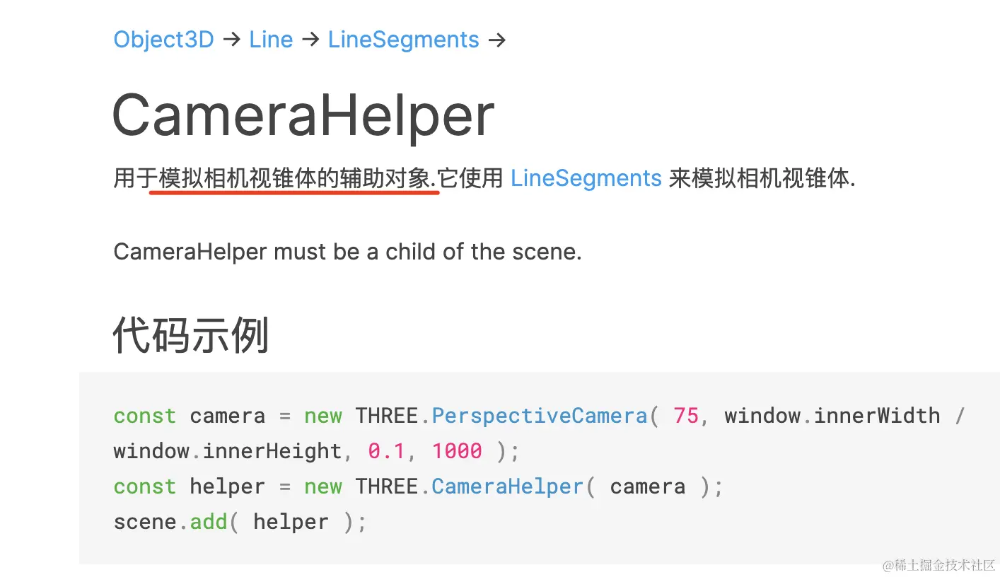

## 深入理解透视相机和视锥体

对于刚接触 Three.js 的同学来说，透视相机的视椎体确实是个比较难理解的概念。

这节我们把它可视化的在 3D 场景中展示出来，这样就容易理解了。

创建项目：

```bash
mkdir perspective-camera
cd perspective-camera
npm init -y
```

安装用到的 ts 类型：

```bash
npm install --save-dev @types/three
```

创建 index.html 和 index.js

要看视椎体的话，我们需要创建另一个相机，用这个相机来观察：

Three.js 提供了一个 CameraHelper 来画视椎体，传入 camera 就行：


