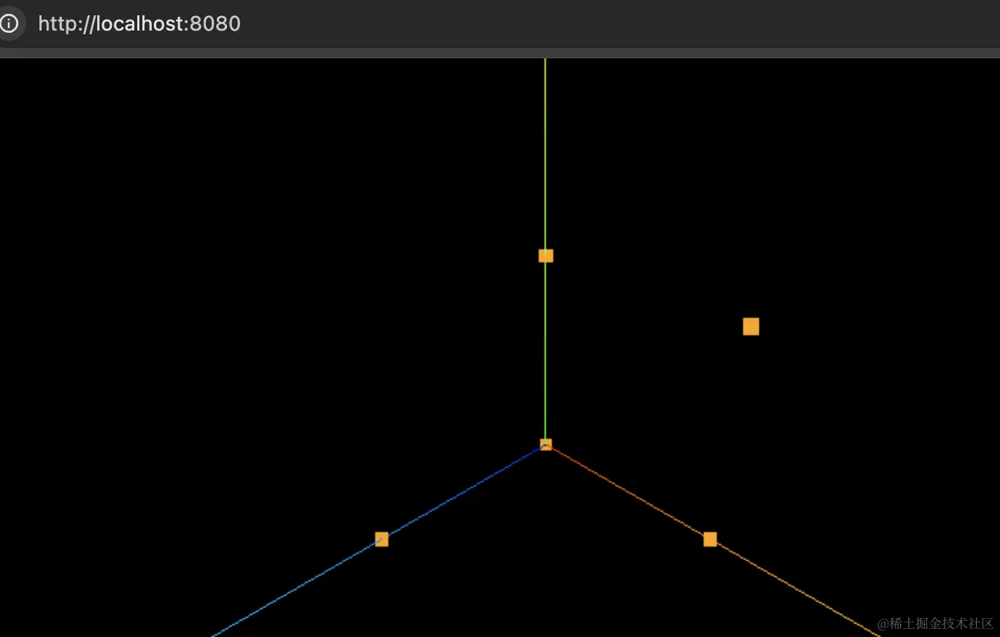
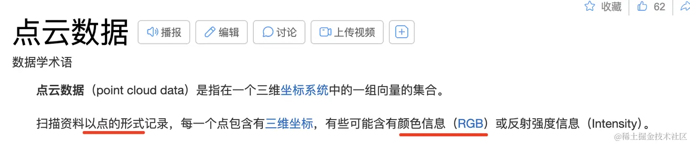
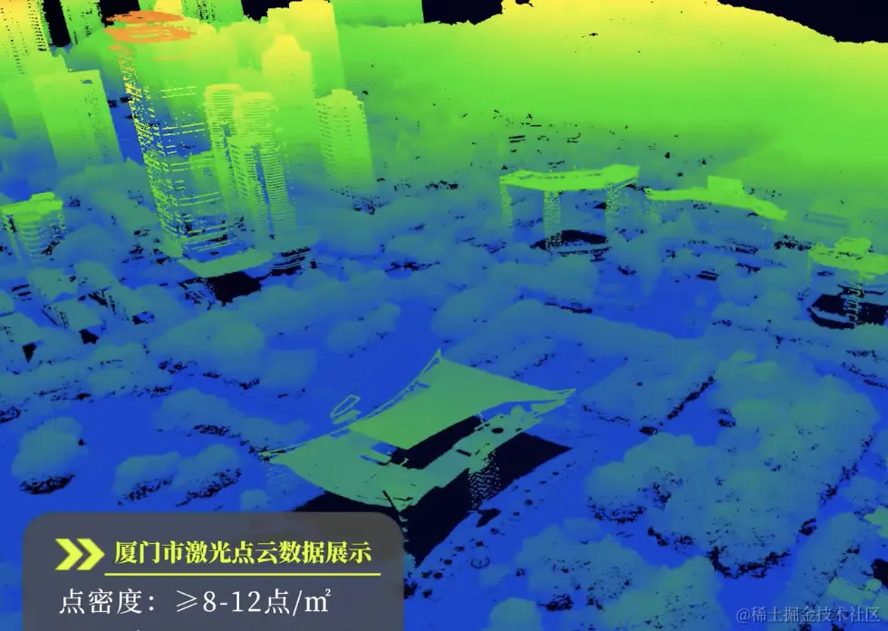
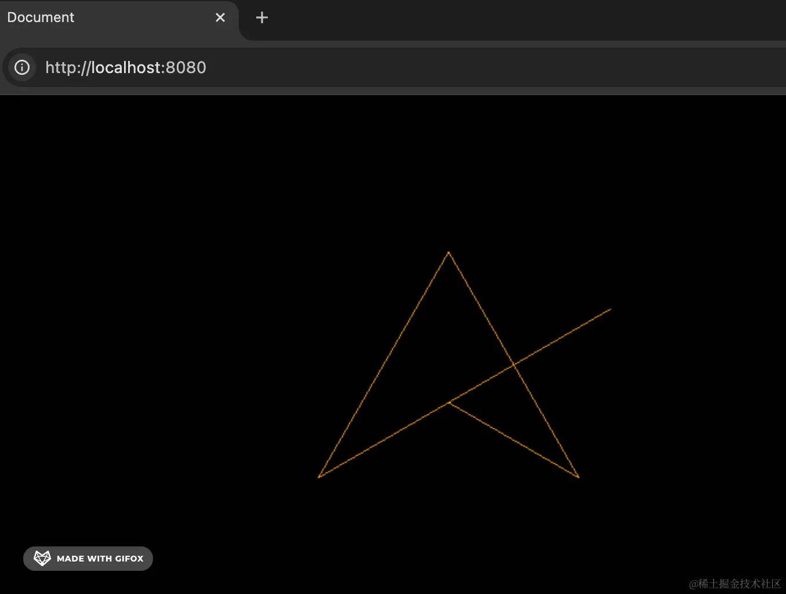
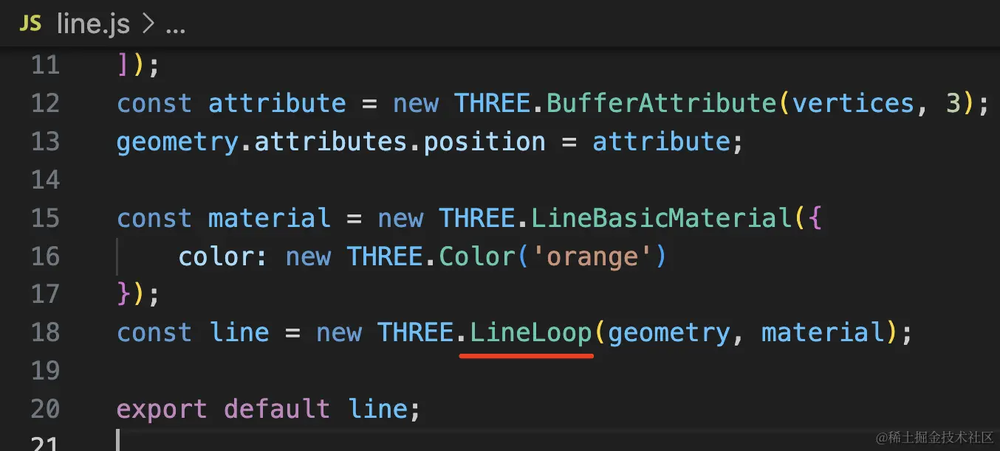
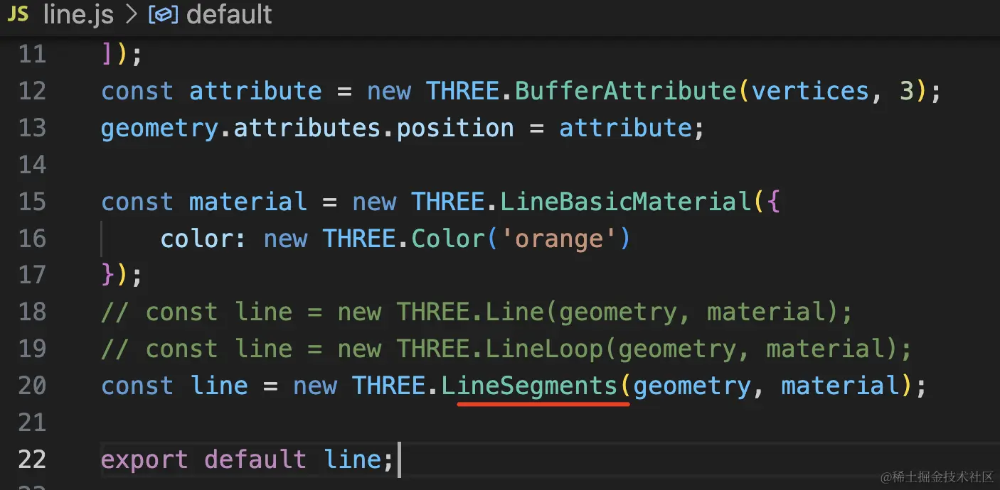
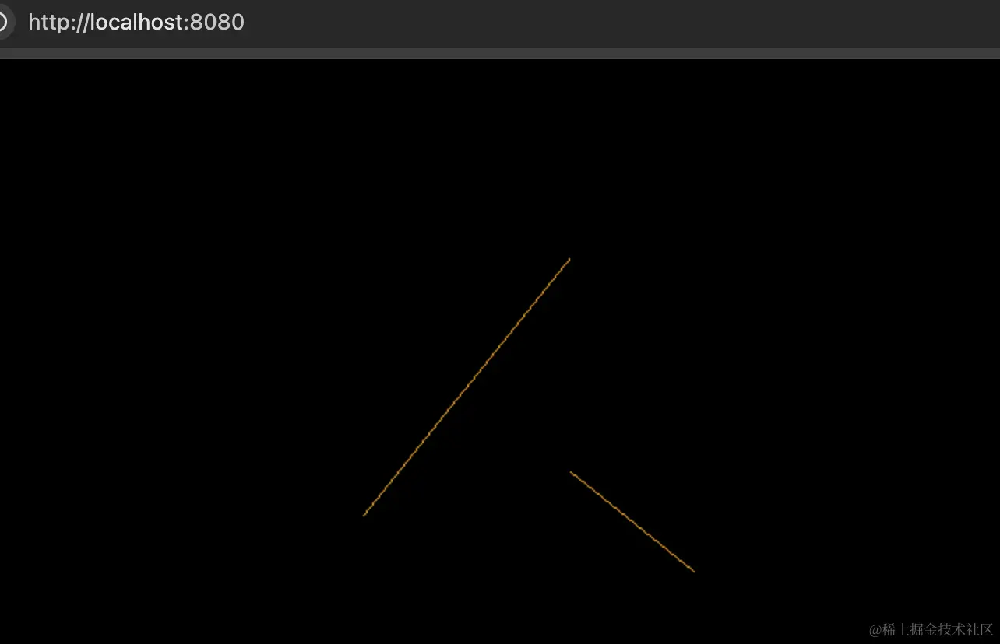
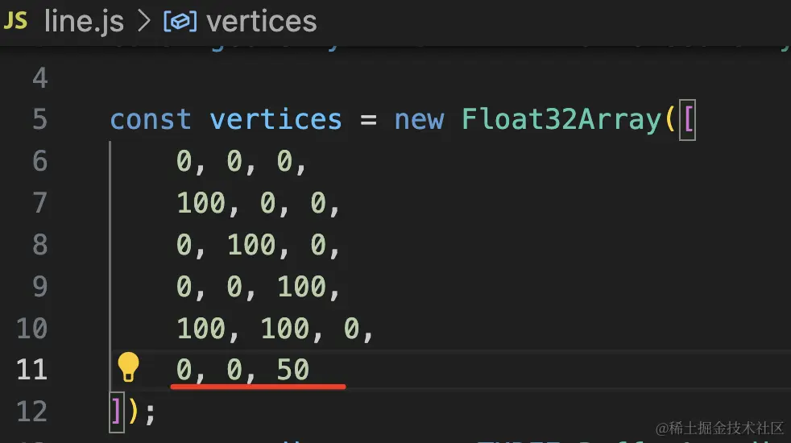
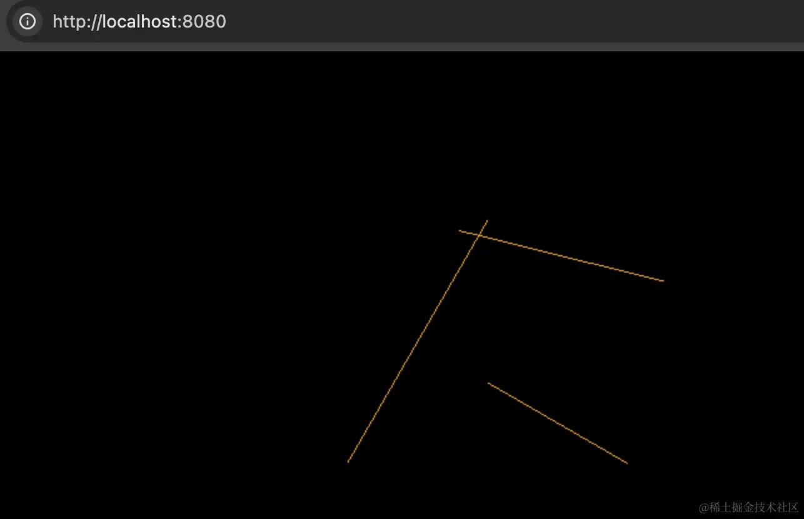

# 点模型、线模型、网格模型

上节我们学了网格模型，也就是每三个顶点构成一个三角形，三角形构成各种几何体。

但顶点除了构成三角形外，也可以直接渲染这些点，或者连成一条条线。

这就是点模型、线模型。

__点模型、线模型、网格模型，这是 Three.js 支持的三种渲染物体的方式。__

我们写代码试一下：

```bash
mkdir point-line-mesh
cd point-line-mesh
npm init -y
```
安装 ts 类型：
```bash
npm install --save-dev @types/three
```
创建 index.html
```html
<!DOCTYPE html>
<html lang="en">
<head>
    <meta charset="UTF-8">
    <meta name="viewport" content="width=device-width, initial-scale=1.0">
    <title>Document</title>
    <style>
        body {
            margin: 0;
        }
    </style>
</head>
<body>
    <script type="importmap">
    {
        "imports": {
            "three": "https://esm.sh/three@0.174.0/build/three.module.js",
            "three/addons/": "https://esm.sh/three@0.174.0/examples/jsm/"
        }
    }
    </script>
    <script type="module" src="./index.js"></script>
</body>
</html>
```
创建 index.js
```js
import * as THREE from 'three';
import {
    OrbitControls
} from 'three/addons/controls/OrbitControls.js';
import mesh from './points.js';

const scene = new THREE.Scene();

scene.add(mesh);

const pointLight = new THREE.PointLight(0xffffff, 10000);
pointLight.position.set(80, 80, 80);
scene.add(pointLight);

const axesHelper = new THREE.AxesHelper(200);
scene.add(axesHelper);

const width = window.innerWidth;
const height = window.innerHeight;

const camera = new THREE.PerspectiveCamera(60, width / height, 1, 1000);
camera.position.set(200, 200, 200);
camera.lookAt(0, 0, 0);

const renderer = new THREE.WebGLRenderer();
renderer.setSize(width, height)

function render() {
    renderer.render(scene, camera);
    requestAnimationFrame(render);
}

render();

document.body.append(renderer.domElement);

const controls = new OrbitControls(camera, renderer.domElement);
```
引入 Three.js，创建 Scene、Light、Camera、Renderer，还有轨道控制器 OrbitControls
## 点模型 Points
然后创建 points.js
```js
import * as THREE from 'three';

const geometry = new THREE.BufferGeometry();

const vertices = new Float32Array([
    0, 0, 0,
    100, 0, 0,
    0, 100, 0,
    0, 0, 100,
    100, 100, 0
]);
const attribute = new THREE.BufferAttribute(vertices, 3);
geometry.attributes.position = attribute;

const material = new THREE.PointsMaterial({
    color: new THREE.Color('orange'),
    size: 10
});
const points = new THREE.Points(geometry, material);

export default points;
```
还是通过 BufferGeometry 创建自定义几何体

添加了一些顶点数据，3 个为一组，设置到 geometry.attributes.position

但这次我们不是用顶点构成三角形来渲染网格模型 Mesh，而是直接渲染点模型 Points

材质也用点模型的专属材质 PointsMaterial，设置 size 为 10

跑一下：
```bash
npx live-server
```

可以看到，在这 5 个顶点渲染了 5 个点，而不是连成三角形。

很多业务场景，是需要渲染点模型的，比如一些点云的业务。



点云就是通过设备扫描出一堆点的坐标和颜色等，然后用 three.js 在网页渲染出来。

比如这样：


## 线模型
然后再来试下线模型：

创建 line.js

```js
import * as THREE from 'three';

const geometry = new THREE.BufferGeometry();

const vertices = new Float32Array([
    0, 0, 0,
    100, 0, 0,
    0, 100, 0,
    0, 0, 100,
    100, 100, 0
]);
const attribute = new THREE.BufferAttribute(vertices, 3);
geometry.attributes.position = attribute;

const material = new THREE.LineBasicMaterial({
    color: new THREE.Color('orange')
});
const line = new THREE.Line(geometry, material);

export default line;

```
几何体不变，把材质换成 LineBasicMaterial，然后创建 Line



在 index.js 里引入，然后注释掉 AxesHelper

可以看到，确实是把这 5 个点连成了 4 条线。

如果你想收尾相连的话，可以用 LineLoop




或者想每两个点一条线段的话，可以用 LineSegments：






这里只有 5 个点，所以是两条线段

再随便加一个点：





就是三条线段了。

线模型有 Line、LineLoop、LineSegments 这三种。

总之，__一堆顶点数据，可以每三个连成一个三角形，然后构成网格模型，绝大多数情况下我们都是用网格模型。__

__也可以单独渲染点，就是点模型，还可以连成线，就是线模型。__

