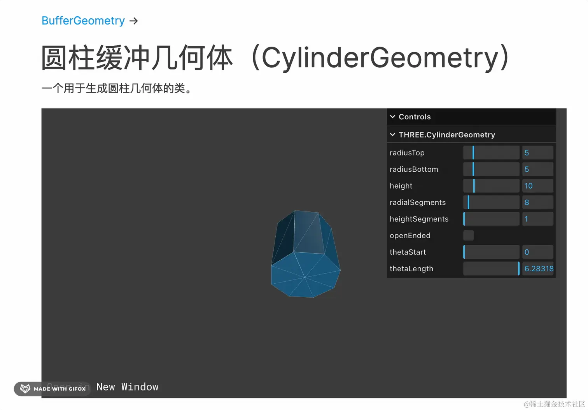

# 点模型、线模型、网格模型

上节我们学了网格模型，也就是每三个顶点构成一个三角形，三角形构成各种几何体。

但顶点除了构成三角形外，也可以直接渲染这些点，或者连成一条条线。

这就是点模型、线模型。

__点模型、线模型、网格模型，这是 Three.js 支持的三种渲染物体的方式。__

我们写代码试一下：

```bash
mkdir point-line-mesh
cd point-line-mesh
npm init -y
```
安装 ts 类型：
```bash
npm install --save-dev @types/three
```
创建 index.html
```html
<!DOCTYPE html>
<html lang="en">
<head>
    <meta charset="UTF-8">
    <meta name="viewport" content="width=device-width, initial-scale=1.0">
    <title>Document</title>
    <style>
        body {
            margin: 0;
        }
    </style>
</head>
<body>
    <script type="importmap">
    {
        "imports": {
            "three": "https://esm.sh/three@0.174.0/build/three.module.js",
            "three/addons/": "https://esm.sh/three@0.174.0/examples/jsm/"
        }
    }
    </script>
    <script type="module" src="./index.js"></script>
</body>
</html>
```
创建 index.js
```js
import * as THREE from 'three';
import {
    OrbitControls
} from 'three/addons/controls/OrbitControls.js';
import mesh from './points.js';

const scene = new THREE.Scene();

scene.add(mesh);

const pointLight = new THREE.PointLight(0xffffff, 10000);
pointLight.position.set(80, 80, 80);
scene.add(pointLight);

const axesHelper = new THREE.AxesHelper(200);
scene.add(axesHelper);

const width = window.innerWidth;
const height = window.innerHeight;

const camera = new THREE.PerspectiveCamera(60, width / height, 1, 1000);
camera.position.set(200, 200, 200);
camera.lookAt(0, 0, 0);

const renderer = new THREE.WebGLRenderer();
renderer.setSize(width, height)

function render() {
    renderer.render(scene, camera);
    requestAnimationFrame(render);
}

render();

document.body.append(renderer.domElement);

const controls = new OrbitControls(camera, renderer.domElement);
```
引入 Three.js，创建 Scene、Light、Camera、Renderer，还有轨道控制器 OrbitControls
## 点模型 Points
然后创建 points.js
```js
import * as THREE from 'three';

const geometry = new THREE.BufferGeometry();

const vertices = new Float32Array([
    0, 0, 0,
    100, 0, 0,
    0, 100, 0,
    0, 0, 100,
    100, 100, 0
]);
const attribute = new THREE.BufferAttribute(vertices, 3);
geometry.attributes.position = attribute;

const material = new THREE.PointsMaterial({
    color: new THREE.Color('orange'),
    size: 10
});
const points = new THREE.Points(geometry, material);

export default points;
```
还是通过 BufferGeometry 创建自定义几何体

添加了一些顶点数据，3 个为一组，设置到 geometry.attributes.position

但这次我们不是用顶点构成三角形来渲染网格模型 Mesh，而是直接渲染点模型 Points

材质也用点模型的专属材质 PointsMaterial，设置 size 为 10

跑一下：
```bash
npx live-server
```

可以看到，在这 5 个顶点渲染了 5 个点，而不是连成三角形。

很多业务场景，是需要渲染点模型的，比如一些点云的业务。


点云就是通过设备扫描出一堆点的坐标和颜色等，然后用 three.js 在网页渲染出来。

比如这样：


## 线模型
然后再来试下线模型：

创建 line.js

```js
import * as THREE from 'three';

const geometry = new THREE.BufferGeometry();

const vertices = new Float32Array([
    0, 0, 0,
    100, 0, 0,
    0, 100, 0,
    0, 0, 100,
    100, 100, 0
]);
const attribute = new THREE.BufferAttribute(vertices, 3);
geometry.attributes.position = attribute;

const material = new THREE.LineBasicMaterial({
    color: new THREE.Color('orange')
});
const line = new THREE.Line(geometry, material);

export default line;

```
几何体不变，把材质换成 LineBasicMaterial，然后创建 Line


在 index.js 里引入，然后注释掉 AxesHelper

可以看到，确实是把这 5 个点连成了 4 条线。

如果你想收尾相连的话，可以用 LineLoop


或者想每两个点一条线段的话，可以用 LineSegments：


这里只有 5 个点，所以是两条线段

再随便加一个点：


就是三条线段了。

线模型有 Line、LineLoop、LineSegments 这三种。

总之，__一堆顶点数据，可以每三个连成一个三角形，然后构成网格模型，绝大多数情况下我们都是用网格模型。__

__也可以单独渲染点，就是点模型，还可以连成线，就是线模型。__

## 网格模型 Mesh

其实网格模型还有个正反面的概念

创建 mesh.js

```js
import * as THREE from 'three';

const geometry = new THREE.BufferGeometry();

const vertices = new Float32Array([
    0, 0, 0,
    100, 0, 0,
    0, 100, 0,
    100, 100, 0
]);

const attribute = new THREE.BufferAttribute(vertices, 3);
geometry.attributes.position = attribute;

const indexes = new Uint16Array([
    0, 1, 2, 2, 1, 3
]);
geometry.index = new THREE.BufferAttribute(indexes, 1);

const material = new THREE.MeshBasicMaterial({
    color: new THREE.Color('orange')
});

const mesh = new THREE.Mesh(geometry, material);

export default mesh;
```

这个就是我们实现 PlaneGeometry 的代码，4 个顶点，然后 6 个顶点索引，构成 2 个三角形。


引入 mesh，放开 AxesHelper 的注释。

看下效果：


现在正面是可见的，但是反过来就不可见了。

改下顶点索引的最后两个顶点的顺序，1、3 改成 3、1：


虽然连起来还是同一个三角形。

但这时候你看下效果：


正反面不一样了。

这是为什么呢？

Three.js 规定了：__从相机看过去的方向，如果一个三角形是逆时针连接的顶点，就是正面，顺时针就是反面。__

所以我们改了下连接顶点的顺序，三角形就反过来了。

默认是正面可见，如果你想双面可见，可以在材质里设置下：


```js
const material = new THREE.MeshBasicMaterial({
    color: new THREE.Color('orange'),
    side: THREE.DoubleSide
});
```


现在不管正面、反面，就都是可见的了。

此外，几何体还有分段的概念：

创建 mesh2.js

```js
import * as THREE from 'three';

const geometry = new THREE.PlaneGeometry(100, 100, 2, 3);

const material = new THREE.MeshBasicMaterial(({
    color: new THREE.Color('orange'),
    wireframe: true
}));

const mesh = new THREE.Mesh(geometry, material);

console.log(mesh);

export default mesh;
```
PlaneGeometry 的第三、四个参数就是宽和高的分段数。

你可以点进去看下 ts 类型：


啥叫分段呢？

跑一下就知道了：


可以看到，这个矩形平面是先水平分了 2 段，竖直分了 3 段，然后再内部画三角形。

看下顶点数：

首先，geometry.attributes.position 是 12，也就是 12 个不重复的顶点。

然后顶点索引数是 36：

因为要构成 12 个三角形，需要 36 个顶点索引。

那分段有啥意义呢，顶点多了，性能不是会变差么？

我们换个几何体来看看：

比如圆柱几何体 [CylinderGeometry：](https://threejs.org/docs/index.html?q=Geometry#api/zh/geometries/CylinderGeometry)

他可以设置 heightSegments、radialSegments，也就是高度方向的分段，圆的分段。
我们调下试试：

先调下 heightSegments：


再调下 radialSegments：


可以看到，圆的分段越多，看起来越圆，虽然实际上还是画的三角形。

但分段不是越多越好，会导致性能变差。

设置一个适中的值就好了。

我们自己试一下这个 CylinderGeometry：

创建 mesh3.js
```js
import * as THREE from 'three';

const geometry = new THREE.CylinderGeometry(50, 50, 80);

const material = new THREE.MeshBasicMaterial(({
    color: new THREE.Color('orange'),
    wireframe: true,
}));

const mesh = new THREE.Mesh(geometry, material);

export default mesh;
```
第一参数是上圆的半径，第二个是下圆的半径，第三个参数是高度。

我们还没设置分段数，默认圆的分段数是 32、高度的分段数是 1

跑下看看：


其实默认的分段数 32 就已经很圆了，一般用默认的就行。

我们设置 5 试一下：


这样就不是很圆了。

## 总结
一堆顶点构成的几何体，可以直接渲染点，就是点模型 Points。

也可以渲染每 2 个顶点连成的线，就是线模型 Line。

还可以每 3 个顶点连成的三角形，就是网格模型 Mesh。

线模型有 Line、LineLoop、LineSegments 三种，LineLoop 是首尾相连， LineSegments 是每两个连一条线段。

此外，Mesh 的三角形是有正反面的概念的，从相机的角度看过去，顶点是逆时针连接的就是正面，反之是反面，默认只显示正面，也可以在材质里设置双面可见。

几何体还支持分段，也就是分成几段再细分三角形，分段越多顶点和三角形越多，渲染越精细，但性能也会变差，所以要设置一个适中的值，一般保持默认就行。

绝大多数情况下，我们用的是网格模型 Mesh，有时候也会用到点模型 Points 和线模型 Line。